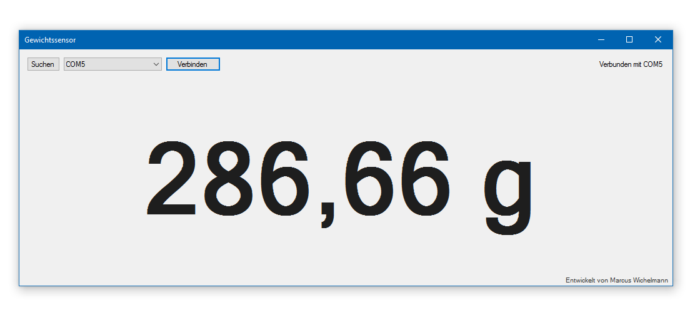

# WeightSensor


Ein Projekt zur einfachen Übertragung der Messerte eines HX711-Gewichtssensors von einem Arduino an ein Anzeigeprogramm für Windows, Linux und (theoretisch auch) OSX.

[Weitere Informationen zum Gewichtssensor](https://www.dfrobot.com/wiki/index.php/Weight_Sensor_Module_V1)

## Arduino flashen
Um das Programm verwenden zu können muss zunächst das beiligende "WeightSensorReader"-Programm auf den Arduino, an dem der Gewichtssensor angeschlossen ist, übertragen werden.

Die beiliegende Projektdatei ist dafür vorgesehen, dass dieser Upload-Prozess über die VisualStudio-IDE mit installiertem VisualMicro-Plugin erfolgt, alternativ kann die `WeightSensorReader.ino` aber auch einfach in der Arduino-IDE geöffnet werden um das Programm damit zu übertragen.

## Programm installieren
### Windows
Im Verzeichnis `WeightSensorViewer/` findet sich eine `setup.exe`  welche das Programm samt aller erforderlichen Komponenten auf dem Computer installiert. Das Programm kann anschließend über das Startmenü oder über eine Desktopverknüpfung gestartet werden.

### Linux
Für Linux steht derzeit noch kein Installationsprogramm zur Verfügung, daher muss das Programm manuell über die Konsole kompiliert werden. Zunächst sollte mit folgenden Befehlen sichergestellt werden, dass die neueste Mono-Runtime auf dem Computer installiert ist.
```
sudo apt-get update
sudo apt-get install mono-complete
```
Anschließend kann das Programm im Verzeichnis `WeightSensorViewer/` wie folgt kompiliert werden:
```
mcs -pkg:dotnet *.cs
```
Sollten dabei Fehler auftreten, prüfen Sie bitte die installierte Version der Mono-Runtime, da Teile des Programmcodes aktuelle Features von C# 6.0 verwenden.

Nach erfolgreichem Kompilieren erscheint im genannten Verzeichnis eine .exe-Datei, welche durch Doppelklick oder mit dem Befehl `./WeightSensorViewer.exe` das Programm startet.

## Erste Schritte
Nach Start des Programmes findet sich im oberen Teil des Programms eine Auswahlbox, mit der der Port ausgewählt werden kann, an dem der Arduino angeschlossen ist. Auf Linux-Sytemen lautet der Portname z.B. `/dev/ttyACM0`, auf Windows-Systemen muss einer der `COM`-Ports gewählt werden (welcher der richtige ist, lässt sich durch Ausprobieren oder über den Geräte-Manager herausfinden). Nach einem Klick auf "Verbinden" wird versucht eine Verbindung zu dem Arduino herzustellen. Der Verbindungsstatus wird dabei oben rechts im Fenster angezeigt.